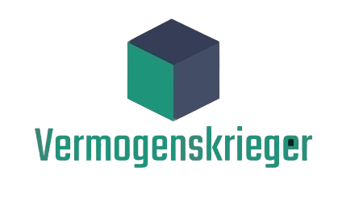
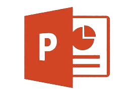
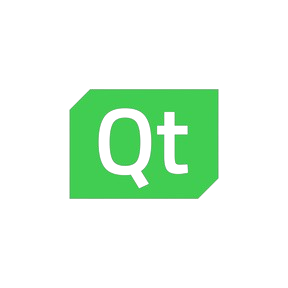

<h1 align="center"> Vermogenskrieger </h1>

    

 

## 🖥️ About

This project uses C++ to simplify essential financial calculations, showing how code can streamline finance tasks. It demonstrates C++'s effectiveness in handling financial data efficiently. 

 

## 🛠️ Languages & Tools
### IDE and collaborative service

    
    
    
    

## Documents

### 📄 Documentation
[Documentation]

### 🧑‍🏫 Presenting
[Presentation](./doc/Vermogenskrieger.pptx)

 

## 📥 Installation
 
    

To download our project, clone this repository, write git clone and then paste this text in your command prompt:

    
<pre>https://github.com/codingburgas/finance-challenge-vermogenskrieger.git</pre>

## 📋 Team Members
| Name                                                   | Role                | Class |
|--------------------------------------------------------|---------------------|-------|
| [Anton Kabakov](https://github.com/ATKabakov22)   | Front end Developer | 🟩10V   |
| [Kalina Atanasova](https://github.com/kkatanasova22) | Front end Developer| 🟩10V   |
| [Kristiyana Hristova](https://github.com/KIHristova22)| Scrum Trainer | 🟩10V   |
| [Rumen Purvanov](https://github.com/RVParvanov22) | Front end Developer  | 🟩10V   |

<h4 align="center"> Made with ❤️
